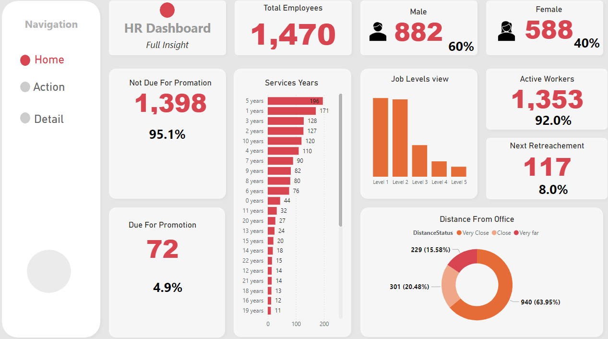
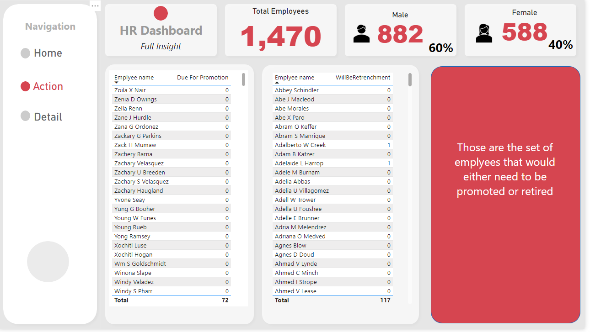

# Power BI Project Summary: Employee Insights Dashboard

## Objective:

To create an interactive Power BI dashboard that provides insights into employee demographics, job satisfaction, performance, and attrition. The goal is to help HR and management make data-driven decisions to improve employee retention, satisfaction, and productivity.

### Page-1 : Home

### Page-2 : Action

### Page-3 : Details

